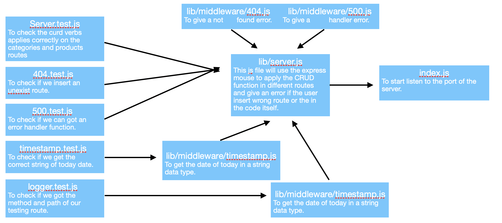
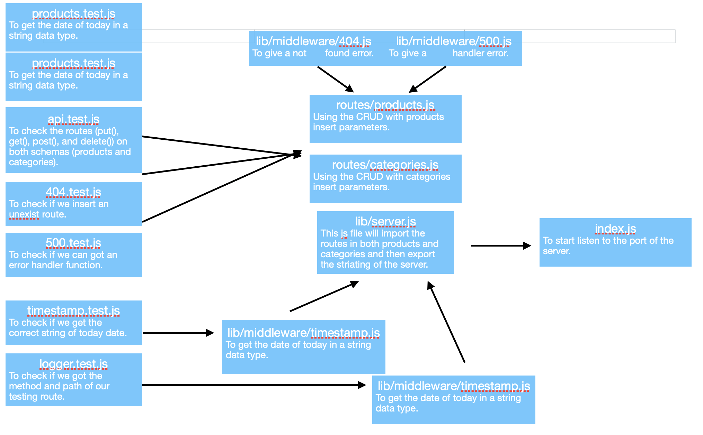
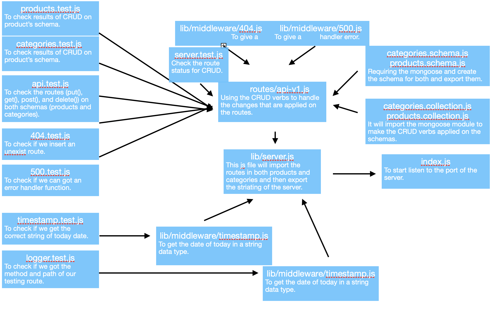

# Api-server App

## Author: Abdulrahman AL-Janabi

## Lab 06

### Desription of today Lab
**This app idea is to use the CRUD methods in order to make a json file with the certain data that we already have either inserted, updated, deleted and got.**

### Dependencies
- npm i -g json-server

### What should I urn on the terminal or postman?
- GET:  http://localhost:3000/categories
- GET - http://localhost:3000/categories/1
- PATCH or PUT - http://localhost:3000/categories/1
- DELETE - http://localhost:3000/categories/1

### Swager Hub
- [Swagger URL](https://app.swaggerhub.com/apis/Janabi/api-server/0.1)

# Api-server App

## Author: Abdulrahman AL-Janabi
## Project: Api Server

## Lab 07

### Desription of today Lab
**Today we create in memory database and applying the CRUD methods on this database (get, post, delete, put) and testing them using the supertest module.**

### Pull Request
- [PR2](https://github.com/Janabi/api-server/pull/2)

### Dependencies
- json-server
- express
- dotenv
- jest
- jest-cli
- supertest
- nodemon

### How to start the server
- node index.js
- npx nodemon / nodemon

### What should I urn on the terminal or postman?
- GET:  http://localhost:3000/categories
- GET - http://localhost:3000/categories/1
- PUT - http://localhost:3000/categories/1
- DELETE - http://localhost:3000/categories/1
- GET:  http://localhost:3000/products
- GET - http://localhost:3000/products/1
- PUT - http://localhost:3000/products/1
- DELETE - http://localhost:3000/products/1

### UML

# Api-server App

## Author: Abdulrahman AL-Janabi
## Project: Api Server

## Lab 08

### Desription of today Lab
**Today we create a mongo database and applying the CRUD methods on this database (get, post, delete, put) and testing them using the supergoose module.**

### Pull Request
- [PR2](https://github.com/Janabi/api-server/pull/3)

### Dependencies
- json-server
- express
- dotenv
- jest
- jest-cli
- @code-fellows/supergoose
- nodemon
- cors
- mongoose
- morgan

### Database
- mongodb (database name: api-server-app)

### .env
PORT=3000
MONGODB_URI='mongodb://localhost:27017/api-server-app'

### How to start the server
- node index.js
- npx nodemon / nodemon

### What should I urn on the terminal or postman?
- GET:  http://localhost:3000/categories
- GET - http://localhost:3000/categories/_id
- PUT - http://localhost:3000/categories/_id
- DELETE - http://localhost:3000/categories/_id
- GET:  http://localhost:3000/products
- GET - http://localhost:3000/products/_id
- PUT - http://localhost:3000/products/_id
- DELETE - http://localhost:3000/products/_id
***Get the ID from the database***

### UML

# Api-server App

## Author: Abdulrahman AL-Janabi
## Project: Api Server

## Lab 09

### Desription of today Lab
**Today we create a mongo database and applying the CRUD methods on this database (get, post, delete, put) and testing them using the supergoose module. Also, we used a router.param to use it in the all CRUD methods.**

### Pull Request
- [PR4](https://github.com/Janabi/api-server/pull/4)
- [PR4](https://github.com/Janabi/api-server/pull/5)

### Dependencies
- json-server
- express
- dotenv
- jest
- jest-cli
- @code-fellows/supergoose
- supertest
- nodemon
- cors
- mongoose
- morgan

### Database
- mongodb (database name: api-server-app)

### .env
PORT=3000
MONGODB_URI='mongodb://localhost:27017/api-server-app'

### How to start the server
- node index.js
- npx nodemon / nodemon

### What should I urn on the terminal or postman?
- GET:  http://localhost:3000/categories
- GET - http://localhost:3000/categories/_id
- PUT - http://localhost:3000/categories/_id
- DELETE - http://localhost:3000/categories/_id
- GET:  http://localhost:3000/products
- GET - http://localhost:3000/products/_id
- PUT - http://localhost:3000/products/_id
- DELETE - http://localhost:3000/products/_id
***Get the ID from the database***

### UML
